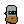
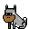
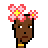
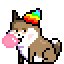
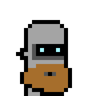
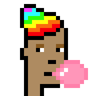
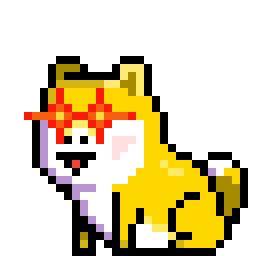
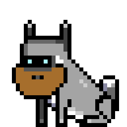
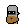
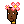

# Ordinal Base Server

ordbase - zero-config web server / services; (auto-)downloads & serves pre-configured pixel art collections "out-of-the-box"; incl. 2x/4x/8x zoom for bigger image sizes and more; binaries for easy "xcopy" installation for windows, linux & friends


## Download Binaries For Easy "Xcopy" Installation

Find the archives to download  - about 3 Megabytes (MB) - for Windows, Linux and Friends at the [**Releases Page »**](https://github.com/ordbase/ordbase.server/releases).

Unpack the archive (e.g. `ordbase-*.tar.gz` or `ordbase-*.zip`) and than start / run the binary:

```
$ ordbased
```

This will start-up a (web) server (listening on port 8080). To test open up `http://localhost:8080` in your browser (to get the index web page listing all collections).


## Build & Run From Source


Use / issue / type  (in the `/ordbase.server` directory):

```
$ go build ordbased.go
```

to get a zero-config x-copy binary for your operation system / architecture.
To run use:

```
$ ordbased
```

This will start-up a (web) server (listening on port 8080). To test open up `http://localhost:8080` in your browser (to get the index web page listing all collections).


## Ordbase - The Server Edition

The ordbase (web) server will (auto-)download on demand the first-time only pre-configured
pixel art collections (using all-in-one image composites)
to your working directory and use the "cached" version from the next time on (incl. server restarts).


The pixel art collections pre-configured¹ include:


- [ordinalpunks](https://github.com/ordbase/ordinals.sandbox/blob/master/i/ordinalpunks.png) (24x24)
- [ordinalphunks](https://github.com/ordbase/ordinals.sandbox/blob/master/i/ordinalphunks.png) (24x24)
- [lilordinalphunks](https://github.com/ordbase/ordinals.sandbox/blob/master/i/lilordinalphunks.png) (24x24)
- [ordoggies](https://github.com/ordbase/ordinals.sandbox/blob/master/i/ordoggies.png) (32x32)
- [bitcoinpunks](https://github.com/ordbase/ordinals.sandbox/blob/master/i/bitcoinpunks.png) (24x24)
- And more


¹: see [collections.csv](collections.csv)


Bonus: For more see the [**Ordinals Sandbox (& Cache)** »](https://github.com/ordbase/ordinals.sandbox)


### (Web) Services


To get pixel art images, use `/:name/:id[.png|.svg]`.

Let's try the (default)
binary raster graphics format
using the portable network graphics (.png) encoding.
Example:

`/ordinalpunks/0`, `/ordinalpunks/1`, `/ordinalpunks/2`,
(same as `/ordinalpunks/0.png`, `/ordinalpunks/1.png`, `/ordinalpunks/2.png`) ...




or `/ordoggies/0`, `/ordoggies/1`, `/ordoggies/2`,
(same as `/ordoggies/0.png`, `/ordoggies/1.png`, `/ordoggies/2.png`)  ...





Let's try the scalable vector graphics (.svg) format in text.
Example:


`/ordinalpunks/0.svg`, `/ordinalpunks/1.svg`, `/ordinalpunks/2.svg`, ...


or `/ordoggies/0.svg`, `/ordoggies/1.svg`, `/ordoggies/2.svg`,  ...


Note: Pixels get "encoded" as rectangle "shapes" with a width and height
of one (1×1).  Transparent pixels
with the red/green/blue/alpha (rgba) value of (0 or 0/0/0/0)
get dropped.


#### z (zoom) Parameter - 2x, 4x, 8x, 10x, 20x ...   (.png only)


Note: The default image size is the default
(minimum) pixel size of the collection e.g. 24x24 for punks, morepunks,
coolcats and so on.
Use the z (zoom) parameter to upsize.

Let's try 2x:


`/ordinalpunks/0?z=2`, `/ordinalpunks/1?z=2`, `/ordinalpunks/2?z=2`, ...





or `/ordoggies/0?z=2`, `/ordoggies/1?z=2`, `/ordoggies/2?z=2`, ...





Let's try 8x:


`/ordinalpunks/0?z=8`, `/ordinalpunks/1?z=8`, `/ordinalpunks/2?z=8`, ...





or `/ordoggies/0?z=8`, `/ordoggies/1?z=8`, `/ordoggies/2?z=8`, ...  And so on.





#### bg (background) Parameter    (.png only)

Let's try adding the classic orange background
in red/green/blue (rgb) hexcode `#ff9900`.
Use the bg (background) parameter:

`/ordinalpunks/0?bg=ff9900`, `/ordinalpunks/1?bg=ff9900`, `/ordinalpunks/2?bg=ff9900`, ...

.png)
.png)
.png)


#### silhouette Parameter    (.png only)

Let's try a black silhouette.
Use the silhouette parameter:

`/ordinalpunks/0?silhouette=black`, `/ordinalpunks/1?silhouette=black`, `/ordinalpunks/2?silhouette=black`, ...

.png)
.png)
.png)


#### Bonus -  Glory to Ukraine! Fuck (Vladimir) Putin! Stop the War! - Send A Stop The War Message To The World With Your Profile Picture


Let's try two-colored with the background in blue
and the silhouette (foreground) in yellow:

`/ordinalpunks/0?bg=ukraineblue&silhouette=ukraineyellow`, `/ordinalpunks/1?bg=ukraineblue&silhouette=ukraineyellow`, `/ordinalpunks/2?bg=ukraineblue&silhouette=ukraineyellow`, ...

_silhouette(ukraineyellow).png)
_silhouette(ukraineyellow).png)
_silhouette(ukraineyellow).png)


Let's try the ukraine flag in the background:

`/ordinalpunks/0?flag=ukraine`, `/ordinalpunks/1?flag=ukraine`, `/ordinalpunks/2?flag=ukraine`, ...

.png)
.png)
.png)


####  Bonus  -  Philip! Phree the Phunks!

Let's try to flip vertically, that is, mirror, the images -
that turns right-looking images into left-looking and vice versa.
Use the m (mirror) parameter:


`/ordinalpunks/0?m=t`, `/ordinalpunks/1?m=t`, `/ordinalpunks/2?m=t`, ...






That's it for now.


## Questions? Comments?

Post them over at the [Help & Support](https://github.com/geraldb/help) page. Thanks.
